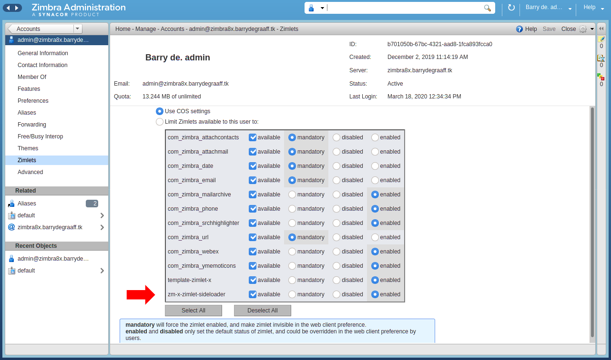
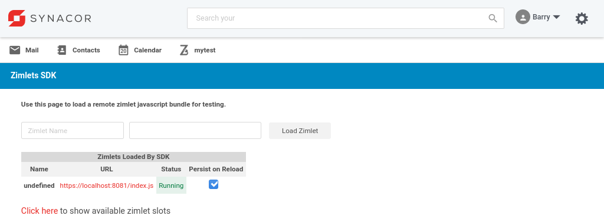

# Adding attachments from a Zimlet

This article explains how to write a Zimlet that allows a user to attach files from a third party service. This way users can attach files from any service you wish to integrate directly from Zimbra. If you are new to Zimlets please take a look at the previous article at https://github.com/Zimbra/zm-zimlet-guide.

## Prerequisites 

To follow the steps in this article you need a Zimbra test server. You will need to have Zimbra 9 Network Edition. You can set this up in a Virtual Machine in the cloud or you can install it on your local computer inside VirtualBox/KVM/Parallels etc. If you decide to set it up on your local computer you need at least an i5 with 16GB of RAM and a SSD. Your test server needs to be accessible over SSH. Instructions on how to set up your Zimbra server: https://blog.zimbra.com/2018/01/install-zimbra-collaboration-8-8-ubuntu-16-04-lts/ make sure to install the latest patches. You can find instructions on how to install patches at https://wiki.zimbra.com/wiki/Zimbra_Releases

## Deploy the Zimlet Sideloader

You need to deploy and enable the Zimlet Sideloader on your development server. You only have to do this step once. 

      yum install zimbra-zimlet-sideloader
      apt install zimbra-zimlet-sideloader
      su - zimbra
      zmmailboxdctl restart


*Verify that the Sideloader Zimlet is available and enabled for your Zimbra Class of Service (CoS) by logging into the Admin UI -> Home -> Configure -> Class of Service.*


*Verify that the Sideloader Zimlet is available and enabled for your Zimbra and account by logging into the Admin UI -> Home -> Manage -> Accounts.*

## Installing Zimlet CLI

You can develop Zimbra Zimlets on any OS supported by NodeJS (https://nodejs.org/en/download/). This article will include Linux commands you can run on CentOS/Fedora/Redhat and Ubuntu. If you run on a different OS reading these commands should help you understand what you must do to get started. 

Zimbra provides a tool called Zimlet CLI that is based on Webpack. It is used for building/packaging your Zimlet and for working with Zimlet templates. Install it on your local computer:

As root:

      yum install nodejs
      apt install nodejs
      npm install -g @zimbra/zimlet-cli


## Downloading and running the Attacher Zimlet

Create a folder on your local computer to store the Attacher Zimlet:

      mkdir ~/zimbra_course_pt4
      cd ~/zimbra_course_pt4
      git clone https://github.com/Zimbra/zimbra-zimlet-attacher
      cd zimbra-zimlet-attacher
      npm install
      zimlet watch

The output of this command should be:

```
Compiled successfully!

You can view the application in browser.

Local:            https://localhost:8081/index.js
On Your Network:  https://192.168.1.100:8081/index.js
```

Visit https://localhost:8081/index.js in your browser and accept the self-signed certificate. The index.js is a packed version of the `Attacher Zimlet`. More information about the zimlet command, npm and using SSL certificates can be found in https://github.com/Zimbra/zm-zimlet-guide. 

## Sideload the Attacher Zimlet

Log on to your Zimbra development server and make sure that you are seeing the modern UI. Then append `/sdk/zimlets` to the URL.

> 
*Sideload the Attacher Zimlet by clicking Load Zimlet. The Zimlet is now added to the Zimbra UI in real-time. No reload is necessary.*

> 
*Click the paper clip icon. Then click Attach Zimlet Test to do a demo attachment.*

> 
*Zimbra.png is added as an example to the email.*

## Visual Studio Code

Open the folder `~/zimbra_course_pt4/zimbra-zimlet-attacher` in Visual Studio code to take a look at the code in the Attacher Zimlet. More information on this can be found at: https://github.com/Zimbra/zm-zimlet-guide.

## How to implement the attacher

First step is to implement the Zimlet slot `compose-attachment-action-menu`. This is done in 

* ~/zimbra_course_pt4/zimbra-zimlet-attacher/src/index.js

```javascript
//Load components from Zimbra
import { createElement } from "preact";

//Load the createMore function from our Zimlet component
import createAttacher from "./components/create-attacher";

export default function Zimlet(context) {
	//Get the 'plugins' object from context and define it in the current scope
	const { plugins } = context;
	const exports = {};

	exports.init = function init() {
		const attacher = createAttacher(context);
		plugins.register('slot::compose-attachment-action-menu', attacher);
	};

	return exports;
}

```

The usual wrapper component is used to pass on the context to a class component:

* ~/zimbra_course_pt4/zimbra-zimlet-attacher/src/components/create-attacher/index.js

```javascript
import { createElement } from 'preact';
import Attacher from '../attacher';

export default function createAttacher(context) {
	return props => (
		<Attacher {...props}>{{context}}</Attacher>
	);
}

```

These steps are explained in more detail in https://github.com/Zimbra/zm-zimlet-guide. Now take a look at

* ~/zimbra_course_pt4/zimbra-zimlet-attacher/src/components/attacher/index.js

```javascript
import { createElement, Component, render } from 'preact';
import { ActionMenuItem } from '@zimbra-client/components';
import style from './style';

export default class Attacher extends Component {
    constructor(props) {
        super(props);
        this.zimletContext = props.children.context;
        this.props.onAttachmentOptionSelection(this.chooseLinksFromService);
    };

    //onAttachmentOptionSelection is passed from the Zimlet Slot and allows to add an event handler
    onAttachFilesFromService = () =>
        this.props.onAttachmentOptionSelection(this.chooseFilesFromService);

    chooseFilesFromService = (editor) => {
       this.downloadAndAttachFile("/skins/_base/logos/AppBanner.png", editor);
    }

    downloadAndAttachFile = (path, editor) => {
        var request = new XMLHttpRequest();
        request.open('GET', path);
        request.responseType = "blob";
        request.onreadystatechange = function (e) {
            if (request.readyState == 4) {
                if (request.status == 200) {
                    // Blob and File are defined per window; We need compatibility with the parent Blob for attachments
                    let file = new window.parent.File([request.response], "Zimbra.png", { type: request.response.type });
                    editor.addAttachments([file], false);
                } else {
                    alert('whoops some error occurred');
                }
            }
        }.bind(this);
        request.send();    
    }

    render() {
        const childIcon = (
            <span class={style.appIcon}>
            </span>);

        return (
            <ActionMenuItem icon={childIcon} onClick={this.onAttachFilesFromService}>Attach Zimlet Test</ActionMenuItem>
        );
    }
}

```

The `Attacher` component returns an `ActionMenuItem` that will call `onAttachFilesFromService` once it is clicked. The ActionMenuItem is what the user sees in the menu in the UI.

It is important to understand that the `compose-attachment-action-menu` Zimlet slot passes on to our Zimlet the `onAttachmentOptionSelection` prop. We use this prop to set an event handler for the attaching. This piece of code tells Zimbra to call our method `chooseFilesFromService` once the menu is clicked.

```javascript
this.props.onAttachmentOptionSelection(this.chooseFilesFromService);
```

`chooseFilesFromService` then receives the `editor` component that is the Zimbra email composer. You can then use that `editor` to add attachments to the email. You can add as attachment using:

```javascript
editor.addAttachments([file], false);
```

or attach inline using:

```javascript
editor.embedImages([file], false);
```

The first is an array filled with attachments in Javascript blob's, if you only have one attachment to upload you have to enclose it in an array. The second argument is a boolean. When true it will ask Zimbra to enforce the maximum file size of the attachment.


